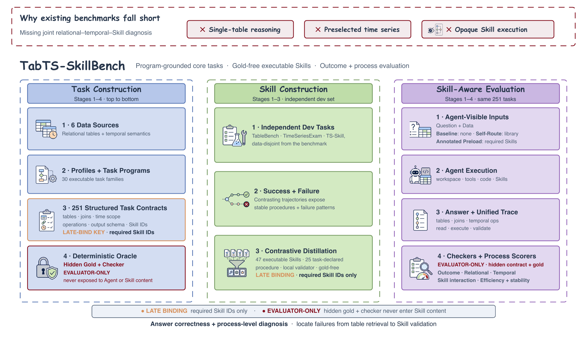
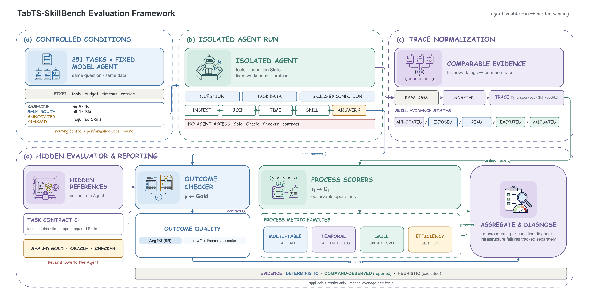
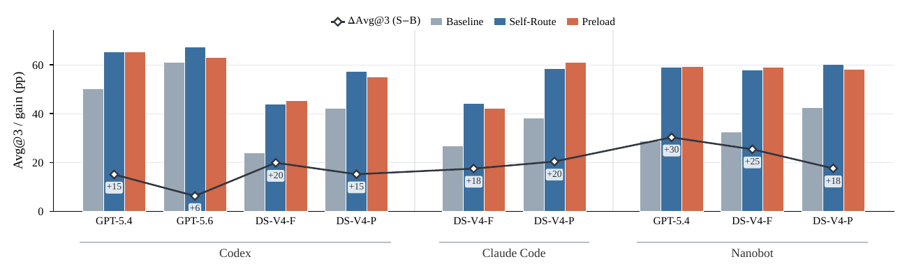

<div align="center">

# TabTS-SkillBench

### Evaluating whether data-analysis agents can select, execute, and validate reusable Skills on multi-table temporal tasks

[](https://github.com/adinczt-up/TabTS-SkillBench/actions/workflows/ci.yml)     

[Quick start](#quick-start) · [Benchmark design](#benchmark-design) · [Prepare data](#prepare-the-data) · [Run evaluation](#run-the-benchmark) · [Reproduce paper results](#reproduce-the-paper-results) · [中文说明](README_zh-CN.md)

</div>

> [!NOTE]
> **Research release (`0.1.0`).** This repository contains the complete 251-task benchmark, evaluator, Skill library, data-preparation workflow, and paper-result reconstruction package.

TabTS-SkillBench is a benchmark for **Skill-aware data-analysis agents**. It tests more than answer generation: an agent must inspect relational tables, recover joins and entity universes, apply temporal operations at the correct granularity, use the available Skill library, and return an answer that satisfies a deterministic output contract.

The release provides:

- a versioned set of **251 tasks across 30 task families**;
- public task views plus deterministic evaluator contracts and Gold references;
- a **47-module Skill library** with explicit applicability, procedures, guardrails, and validation guidance;
- isolated execution adapters and a common trace representation;
- answer, relational, temporal, Skill-interaction, and efficiency metrics; and
- offline reconstruction of the paper's main tables and figures without model API calls.

<p align="center">
  <a href="docs/assets/tabts-skillbench-overview.png">
    
  </a>
</p>

<p align="center"><sub>Benchmark overview: relational-temporal task construction, data-disjoint Skill development, controlled evaluation on the final 251 tasks, and outcome-plus-process diagnosis. Click the figure to enlarge.</sub></p>

## At a glance

| Dimension                      |                                    Release |
|--------------------------------|-------------------------------------------:|
| Tasks                          |                                        251 |
| Task families                  |                                         30 |
| Upstream data sources          |                                          6 |
| Required tables per task       |                                        2-5 |
| Skill library                  |                                 47 modules |
| Scripted Skill modules         |                                         43 |
| Benchmark-active routed Skills |                                         25 |
| Required-execution Skills      |                                         23 |
| Evaluation conditions          |                                          3 |
| Paper experiment matrix        | 9 model-harness configurations × 3 repeats |

The Skill counts describe different properties and are not interchangeable. Some modules are reusable documentation-only procedures; some include executable scripts; and only the benchmark-active subset is referenced by the released task contracts.

## Benchmark design

### Three controlled conditions

| Condition | Agent access | Research question |
|----|----|----|
| `baseline` | No benchmark Skill library | What can the model-harness system solve unaided? |
| `self_route` | The full permitted Skill library | Can the agent select and use the right Skills? |
| `annotated_preload` | Task-annotated Skills are preloaded | What changes when routing is supplied? |

`annotated_preload` is not an Oracle condition. The legacy name `oracle_skill` is retained only as a runtime compatibility alias.

### Outcome and process evaluation

Strict Success (`Avg@3` in the paper) is the primary outcome. A response must satisfy the expected rows, fields, schema, and values; partial-credit metrics are diagnostic rather than substitutes for strict correctness.

The normalized trace also supports four process-metric families:

| Family | Metrics | What it diagnoses |
|----|----|----|
| Multi-table | REA, DAR | Relation/entity access and dependency-aware retrieval |
| Temporal | TEA, TD-F1, TCC | Temporal execution, dependency coverage, and consistency |
| Skill interaction | SkE-F1, SVR | Skill execution evidence and validation |
| Efficiency | Calls, C/S | Tool-use cost and calls per successful task |

Process metrics are observable trace proxies. They are useful for locating failures, but they do not expose hidden model reasoning and should not be interpreted as direct semantic proof.

A versioned normalized-trace schema and three safe synthetic contract/scoring
examples are available in
[`docs/normalized-traces/v1/`](docs/normalized-traces/v1/). These examples are
not paper experiment runs and cannot be used to validate reported paper results.

### Visibility boundary

Each formal run is split into two security domains:

1.  The **runner** receives a sanitized task, condition-allowed Skills, read-only task assets, tools, and writable scratch space.
2.  The **evaluator** receives the final answer and normalized trace, then applies hidden contracts, Gold references, checkers, and process scorers.

The Agent must never be able to read evaluator-only files during execution. See [EVALUATION_PROTOCOL.md](EVALUATION_PROTOCOL.md) for the normative protocol and [SECURITY.md](SECURITY.md) before running model-generated code.

<p align="center">
  <a href="docs/assets/tabts-skillbench-evaluation-framework.png">
    
  </a>
</p>

<p align="center"><sub>The Agent sees only the question, task data, tools, and condition-allowed Skills. Gold, Oracle material, contracts, and checkers remain evaluator-only. Click the figure to enlarge.</sub></p>

## Quick start

Static validation and paper-result reproduction do not require benchmark data or model API credentials.

```bash
git clone https://github.com/adinczt-up/TabTS-SkillBench.git
cd TabTS-SkillBench

python3.11 -m venv .venv
source .venv/bin/activate
python -m pip install -e ".[dev]"

python tools/verify_public_release.py --root .
python -m pytest -q
python scripts/paper/reproduce_all.py
python tools/verify_paper_results.py
```

Expected release checks include exactly 251 tasks, matching public/evaluator task IDs, 47 Skill modules, 39 standardized asset records, and a verified paper artifact checksum inventory.

## Prepare the data

The standardized Parquet tables are not stored in Git and are not distributed as a combined archive. TabTS-SkillBench is therefore an open benchmark artifact, not a mirror of third-party datasets. Users must obtain every source under its own upstream license or competition terms.

Install the data preparation and scoring dependencies:

```bash
python -m pip install -e ".[benchmark,dev]"
```

Then use the unified data workflow:

```bash
tabts-bench data guide
tabts-bench data prepare
tabts-bench data verify
```

`data prepare` preflights user-provided inputs, runs the deterministic standardizer, and verifies the required 39 output files against [`benchmark/manifests/assets_sha256.json`](benchmark/manifests/assets_sha256.json). It never accepts third-party terms on a user's behalf and never automatically downloads a source marked `user_download_required`.

H&M and Event require users to sign in to Kaggle, review and accept the applicable competition rules, and download the source through the official interface or their own authenticated Kaggle CLI.

Detailed provenance and instructions:

- [data/README.md](data/README.md) - end-to-end preparation guide;
- [data_sources.yaml](data_sources.yaml) - machine-readable source records;
- [DATA_LICENSES.md](DATA_LICENSES.md) - redistribution and attribution status.

## Run the benchmark

Formal Gold-sensitive execution currently requires Linux and Bubblewrap (`bwrap`). The runner creates a minimal task view, stages ordinary file copies, verifies asset hashes, disables web/MCP access, and fails closed when the configured OS-level sandbox is unavailable.

```bash
python -m pip install -e ".[benchmark,runner,dev]"

export BENCHMARK_PYTHON="$PWD/.venv/bin/python"
export NANOBOT_CONFIG="$HOME/.nanobot/config.json"

python -m benchmark_eval.cli pipeline \
  --experiment configs/benchmark.yaml \
  --models-config configs/models.example.yaml \
  --stages validate,run,collect,score,report
```

[`configs/benchmark.yaml`](configs/benchmark.yaml) is the public smoke/release configuration, not the paper's complete nine-configuration experiment matrix. Provider credentials belong in the user's environment or local configuration, never in the repository.

## Reproduce the paper results

The repository releases authoritative three-repeat aggregate results for nine model-harness configurations, task-paired outcomes for six component ablations, and deterministic reconstruction code for:

- Table 2 and Table 3;
- Figures 4, 5, 7, and 8; and
- the paper's headline outcome, process, cost, and correlation values.

<p align="center">
  <a href="docs/assets/tabts-skillbench-avg3-results.png">
    
  </a>
</p>

<p align="center"><sub>Avg@3 across the nine model-harness configurations. Bars show Baseline, Self-Route, and Annotated-Skill Preload; the line and labels show the Self-Route gain over Baseline in percentage points. Click the figure to enlarge.</sub></p>

```bash
python scripts/paper/reproduce_all.py
python tools/verify_paper_results.py
```

Generated outputs are written to [`artifacts/paper/reproduced/`](artifacts/paper/reproduced/). The reproduction package contains only the final 251-task benchmark aggregates and necessary paired binary outcomes. It excludes raw model responses, prompts, reasoning, commands, execution traces, dataset rows, credentials, and private service endpoints.

See [artifacts/paper/README.md](artifacts/paper/README.md) for the artifact inventory and statistical reconstruction details.

## Repository map

| Path | Purpose |
|----|----|
| [`benchmark/tasks/`](benchmark/tasks/) | Agent-visible task definitions |
| [`benchmark/evaluator/`](benchmark/evaluator/) | Evaluator-only contracts, Gold, and task records |
| [`benchmark/manifests/`](benchmark/manifests/) | Versioned task-set and asset identities |
| [`skills/`](skills/) | The 47-module Skill library |
| [`benchmark_eval/`](benchmark_eval/) | Validation, execution, scoring, statistics, and reporting |
| [`isolated_benchmark_runner/`](isolated_benchmark_runner/) | Per-task isolated workspace runner |
| [`configs/`](configs/) | Public experiment and model templates |
| [`artifacts/paper/`](artifacts/paper/) | Released paper results and reconstructed outputs |
| [`scripts/paper/`](scripts/paper/) | Deterministic table and figure reconstruction |

The task IDs in [`benchmark/manifests/task_set_251.json`](benchmark/manifests/task_set_251.json) define the complete released task set. Comparable reports must identify the task-set version and preserve its exact membership.

## Reporting results

At minimum, report:

- repository version or commit;
- task-set name and hash;
- model, provider, and harness identifiers;
- condition, repeat count, and decoding parameters;
- sandbox and asset-staging mode;
- raw and after-repair outcomes;
- infrastructure failures, retries, exclusions, and missing tasks.

Do not compare scores across changed task sets, Gold, contracts, or retry policies without an explicit compatibility analysis. Additional guidance is in the [Benchmark Card](BENCHMARK_CARD.md).

## Release scope and boundaries

The code, final task-set manifest, evaluator, Skill library, data-preparation workflow, and paper-result reconstruction package are included in this release. Upstream datasets are intentionally not bundled: users obtain them from their official sources and prepare them locally with the provided workflow.

The root license does not grant rights to upstream datasets. Review [DATA_LICENSES.md](DATA_LICENSES.md), [THIRD_PARTY_NOTICES.md](THIRD_PARTY_NOTICES.md), and each upstream source's terms before using or redistributing data.

## Contributing and responsible disclosure

Contributions are welcome through [CONTRIBUTING.md](CONTRIBUTING.md). Please use the issue tracker for reproducible bugs and evaluation discrepancies. Do not open a public issue containing credentials, private dataset content, or an exploitable sandbox escape; follow [SECURITY.md](SECURITY.md) instead.
